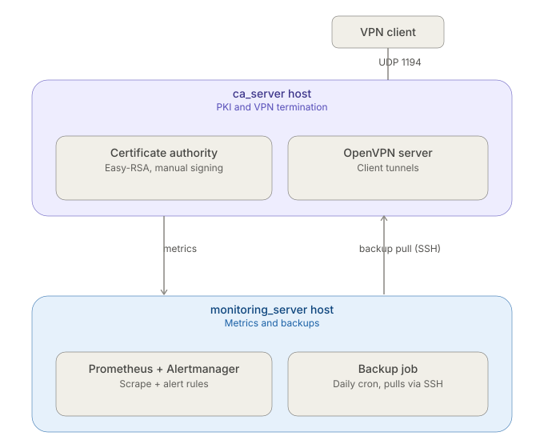

# Infrastructure Automation Stack (PKI + VPN + Monitoring + Backup)

This repository contains a declarative description of an infrastructure stack migrated from disjointed legacy Bash scripts into structured Ansible roles. The project automates the deployment of a secured VPN server, a dedicated Certificate Authority (CA), a continuous metrics collection pipeline, and an isolated backup perimeter.



## Architecture

The infrastructure is split into two target nodes to enforce proper network isolation:
1. **CA & VPN Server (`ca_server`):** The host responsible for signing certificates (Easy-RSA) and terminating client VPN tunnels (OpenVPN).
2. **Monitoring & Backup Server (`monitoring_server`):** An isolated host running Prometheus and Alertmanager to scrape telemetry from all nodes, as well as a cron job that pulls backups from the CA server.

---

## Quick Start

To deploy the entire infrastructure stack, execute the following steps:

1. **Prepare the inventory file:**
```bash
   cp ansible/inventory.example.ini ansible/inventory.ini
```
2. **Configure access credentials:**
   Edit `ansible/inventory.ini` by specifying the actual IP addresses of your VMs, usernames, and paths to your SSH private keys.
3. **Run the playbook:**
```bash
   ansible-playbook -i ansible/inventory.ini ansible/site.yml
```

---

## Manual Prerequisites

As a deliberate design choice, two manual configuration steps have been left unautomated to preserve security guarantees:

1. **Certificate Signing:** The process of issuing and exchanging certificates between the CA and the OpenVPN server is not fully automated. The administrator must manually verify certificate signing requests (CSR) within the Easy-RSA environment to prevent unauthorized key issuance.
2. **SSH Access for Backups:** The backup script executes as `root` on the monitoring server. Before the first run, you must manually append the monitoring server's root public SSH key to the `authorized_keys` file of the deployment user on the CA server to allow passwordless archive downloads.

---

## Architectural Decisions (ADR)

### 1. Choosing Ansible over Custom .deb Packages
* **Decision:** Server configuration and utility deployment have been completely migrated to Ansible roles.
* **Rationale:** Building custom `.deb` packages is impractical for frequently changing application configurations (such as `server.conf` or `prometheus.yml`). Ansible provides a declarative approach, built-in idempotency, and native template management (Jinja2) out of the box, significantly simplifying long-term infrastructure maintenance.

### 2. Retaining Manual Verification for Certificate Signing
* **Decision:** Key generation and signing inside Easy-RSA remain decoupled from automated deployment scripts.
* **Rationale:** This functions as a critical security control. Fully automating the generation and signing of private keys without human intervention introduces substantial risks; a compromise of the automation controller would grant an attacker full control over the entire PKI perimeter.

### 3. Isolating `security_hardening` into a Reusable Role
* **Decision:** Firewall configurations (UFW) and base security policies are decoupled into an independent role that executes first across all hosts.
* **Rationale:** This approach centralizes network access control management. The role utilizes dynamic inventory variables (`hostvars`) to precisely open exporter ports (`9100`, `9176`) exclusively to the monitoring server's IP address, completely preventing public metric exposure.

### 4. Pulling Backups to an Isolated Host
* **Decision:** The `backup-ca.sh` script runs on the monitoring server and pulls `/opt/easy-rsa` archives over SSH rather than storing them locally on the CA.
* **Rationale:** Alignment with disaster recovery best practices. Storing backups locally on the CA server is futile in the event of disk failure or host compromise. An isolated monitoring server guarantees data persistence and integrity.

### 5. Deferring Alertmanager Email Notifications
* **Decision:** Alertmanager is installed and running, and all alert rules fire correctly and are visible in the Prometheus/Alertmanager web UI, but no SMTP receiver is configured — alerts are not actually delivered via email.
* **Rationale:** Configuring a real SMTP delivery path (Gmail App Password, Ansible Vault for the credential) was scoped but deprioritized to close out the project within a tight schedule. The alerting *logic* is fully implemented and verified; only the *delivery channel* is missing.

---

## Known Gaps

* **Alertmanager Email Delivery:** See ADR #5 above — deliberately deferred, not a technical blocker.
* **Missing Alerts:** `SystemdServiceFailed`, `OpenVPNServiceDown`, and `OpenVPNNoClients` were documented in the original v0.9 brief but never implemented — neither in the legacy bash version nor in this Ansible migration. They require exporters/metrics that were only added later (node_exporter, openvpn_exporter) and are left as a known gap for future work.
* **Local Environment Constraint:** The entire stack was developed and verified locally on two VirtualBox VMs (bridged networking) rather than cloud infrastructure. Deploying to a cloud provider (e.g., Yandex Cloud) was deliberately deferred due to a tight project schedule, not a technical limitation.
