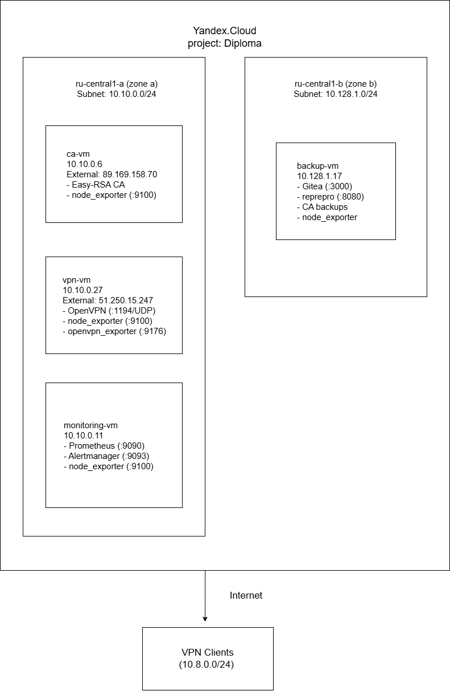

# Diploma Project: Secure Infrastructure

## Project Description

The project is a secure infrastructure in Yandex.Cloud, including:
- Certificate Authority (PKI) based on Easy-RSA
- VPN server based on OpenVPN
- Monitoring system (Prometheus + Alertmanager)
- Backup system (Gitea mirror, reprepro, GPG-encrypted backups)

## Architecture



## Cloud Environment

| Parameter | Value |
|-----------|-------|
| Cloud Provider | Yandex.Cloud |
| Cloud ID | b1g68dl41tuhcto5fj68 |
| Folder ID | b1gg38p7c15uhudv4fmv |
| Region | ru-central1 |
| Zones | ru-central1-a, ru-central1-b |

### Access

| Role | Account | Access Level |
|------|---------|--------------|
| Owner | iamroypchel@gmail.com | Full |

## Service URLs

| Service | URL | Access |
|---------|-----|--------|
| VPN Server | 51.250.15.247:1194/udp | External |
| Prometheus | http://10.10.0.11:9090 | Via VPN |
| Alertmanager | http://10.10.0.11:9093 | Via VPN |
| Gitea | http://10.128.1.17:3000 | Via VPN |
| APT Repo | http://10.128.1.17:8080 | Via VPN |

### Components:

| VM | Internal IP | External IP | Zone | Purpose |
|----|-------------|-------------|------|---------|
| ca-vm | 10.10.0.6 | — | ru-central1-a | Certificate Authority (Easy-RSA) |
| vpn-vm | 10.10.0.27 | 51.250.15.247 | ru-central1-a | OpenVPN server |
| monitoring-vm | 10.10.0.11 | — | ru-central1-a | Prometheus, Alertmanager |
| backup-vm | 10.128.1.17 | — | ru-central1-b | Gitea, reprepro, CA backups |

## Data Streams


## Quick start

### Requirements:
- Yandex.Cloud account
- SSH key
- Ubuntu 22.04 VMs

### Deployment:

```bash
# 1. Clone repository
git clone https://github.com/pchelbisson/access-forge-platform

# 2. Deploy CA server (ca-vm)
sudo dpkg -i packages/ca-server-config.deb
sudo /opt/ca-server/scripts/setup-security.sh
sudo /opt/ca-server/scripts/setup-ca.sh

# 3. Deploy VPN server (vpn-vm)
sudo dpkg -i packages/vpn-server_1.0.0_all.deb
sudo /opt/vpn-server/scripts/setup-vpn.sh
sudo /opt/vpn-server/scripts/setup-security.sh
# Sign certificate via CA (see docs/VPN.md)

# 4. Deploy Monitoring (monitoring-vm)
sudo dpkg -i packages/prometheus-server.deb
sudo dpkg -i packages/alertmanager.deb

# 5. Install node_exporter on all VMs
sudo dpkg -i packages/node-exporter_1.7.0_amd64.deb
```

## Repository structure

├── README.md
├── docs/
│   ├── infrastructure.drawio.png
│   ├── data-flows.drawio.png
│   ├── CA.md
│   ├── VPN.md
│   ├── MONITORING.md
│   └── BACKUP.md
└── packages/
    ├── ca-server-config.deb
    ├── vpn-server_1.0.0_all.deb
    ├── prometheus-server.deb
    ├── alertmanager.deb
    ├── node-exporter_1.7.0_amd64.deb
    └── openvpn-exporter_0.3.0_amd64.deb

## Documentation

- **Certification Authority** - PKI setup, certificate signing procedures
- **VPN Server** - OpenVPN configuration, client certificate issuance
- **Monitoring** - Prometheus metrics, alert rules
- **Backup** - Backup strategy, disaster recovery procedures

## Security Features

✅ Air-gapped CA (no external IP)
✅ UFW firewall on all VMs
✅ GPG-encrypted CA backups
✅ Prometheus Basic Auth
✅ Node exporters accessible only from monitoring-vm
