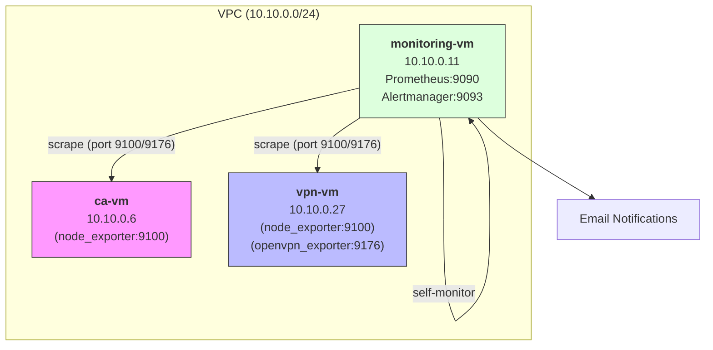

# Monitoring System Design

## Server Info

| Параметр | Значение |
|----------|----------|
| VM | monitoring-vm |
| Internal IP | 10.10.0.11 |
| OS | Ubuntu 22.04 |
| Prometheus | :9090 |
| Alertmanager | :9093 |

## Architecture



## Installation

```bash
# Install packages
sudo dpkg -i prometheus-server_2.49.1_amd64.deb
sudo dpkg -i alertmanager_0.27.0_amd64.deb
sudo dpkg -i node-exporter_1.7.0_amd64.deb
sudo apt-get install -f -y

# Start services
sudo systemctl enable --now prometheus
sudo systemctl enable --now alertmanager
sudo systemctl enable --now node_exporter
```

## Notifications

Alertmanager sends notifications to the email address: `iamroypchel@gmail.com`

Configuration in `/etc/alertmanager/alertmanager.yml`:
```yaml
receivers:
  - name: 'email'
    email_configs:
      - to: 'iamroypchel@gmail.com'
        from: 'alertmanager@diploma.local'
        smarthost: 'smtp.gmail.com:587'
```

## Infrastructure Metrics (all VMs)

Source: **Node Exporter** (port 9100)

| Category | Metric | Description |
|-----------|----------|----------|
| CPU | node_cpu_seconds_total | CPU time by mode |
| CPU | node_load1, node_load5 | Load average |
| Memory | node_memory_MemTotal_bytes | Total RAM |
| Memory | node_memory_MemAvailable_bytes | Available RAM |
| Disk | node_filesystem_size_bytes | File System Size |
| Disk | node_filesystem_avail_bytes | Free File System |
| Disk | node_disk_io_time_seconds_total | I/O time |
| Network | node_network_receive_bytes_total | Incoming traffic |
| Network | node_network_transmit_bytes_total | Outgoing Traffic |
| System | node_boot_time_seconds | Boot Time |
| System | node_time_seconds | Current Time |
| Systemd | node_systemd_unit_state | Service State |

## OpenVPN Monitoring

Source: **OpenVPN Exporter** (port 9176)

| Metric | Description |
|---------|----------|
| openvpn_up | Server status (1=up, 0=down) |
| openvpn_server_connected_clients | Number of connected clients |
| openvpn_server_client_received_bytes_total | Traffic from clients |
| openvpn_server_client_sent_bytes_total | Traffic to clients |

Additionally, via Node Exporter:
- Traffic on the tun0 interface
- Status of the openvpn-server@server systemd service

## Infrastructure alerts

| Alert | PromQL | For | Severity |
|-------|--------|-----|----------|
| InstanceDown | up == 0 | 1m | critical |
| HighCpuUsage | 100 - (avg(rate(node_cpu_seconds_total{mode="idle"}[5m])) * 100) > 80 | 5m | warning |
| HighMemoryUsage | (1 - node_memory_MemAvailable_bytes / node_memory_MemTotal_bytes) * 100 > 90 | 5m | warning |
| DiskSpaceLow | (node_filesystem_avail_bytes / node_filesystem_size_bytes) * 100 < 15 | 5m | warning |
| DiskSpaceCritical | (node_filesystem_avail_bytes / node_filesystem_size_bytes) * 100 < 5 | 1m | critical |
| SystemdServiceFailed | node_systemd_unit_state{state="failed"} == 1 | 1m | critical |

## Alerts for OpenVPN

| Alert | PromQL | For | Severity |
|-------|--------|-----|----------|
| OpenVPNDown | openvpn_up == 0 | 1m | critical |
| OpenVPNServiceDown | node_systemd_unit_state{name="openvpn-server@server.service",state="active"} != 1 | 1m | critical |
| OpenVPNNoClients | openvpn_server_connected_clients == 0 | 1h | info |

## Health Check

```bash
# Prometheus status
sudo systemctl status prometheus
curl -s http://localhost:9090/-/healthy

# Alertmanager status
sudo systemctl status alertmanager
curl -s http://localhost:9093/-/healthy

# Check targets
curl -s http://localhost:9090/api/v1/targets | jq '.data.activeTargets[].health'
```

## Alert Runbook

### InstanceDown
**Meaning:** VM is not responding to Prometheus scraping

**Actions:**
1. Check VM status in YC Console
2. Try SSH: `ssh yc-user@<ip>`
3. If unreachable — check YC Console for issues
4. If VM down — restore from snapshot (see BACKUP.md)

### HighCpuUsage
**Meaning:** CPU usage > 80% for 5+ minutes

**Actions:**
1. SSH to the server
2. Run `top` or `htop` to identify process
3. Check if it's expected load
4. If not — investigate and kill if needed

### DiskSpaceCritical
**Meaning:** Less than 5% disk space remaining

**Actions:**
1. SSH to the server
2. Find large files: `sudo du -sh /* | sort -hr | head -20`
3. Clean old logs: `sudo journalctl --vacuum-time=3d`
4. Remove old backups if safe
5. Consider expanding disk in YC

### OpenVPNDown
**Meaning:** OpenVPN service is not running

**Actions:**
1. SSH to vpn-vm
2. Check status: `sudo systemctl status openvpn-server@server`
3. Check logs: `sudo journalctl -u openvpn-server@server -n 50`
4. Restart: `sudo systemctl restart openvpn-server@server`
5. If certificate issue — check expiration dates

## Security

- Prometheus Web UI is protected with Basic Auth
- Node Exporter is only accessible from VPC (10.10.0.0/24)
- UFW is configured on all VMs
- Port 9100 accepts requests only from monitoring-vm

## Components to Install

| VM | Packages |
|----|--------|
| monitoring-vm | prometheus-server.deb, alertmanager.deb, node-exporter.deb |
| vpn-vm | node-exporter.deb, openvpn-exporter.deb |
| ca-vm | node-exporter.deb |