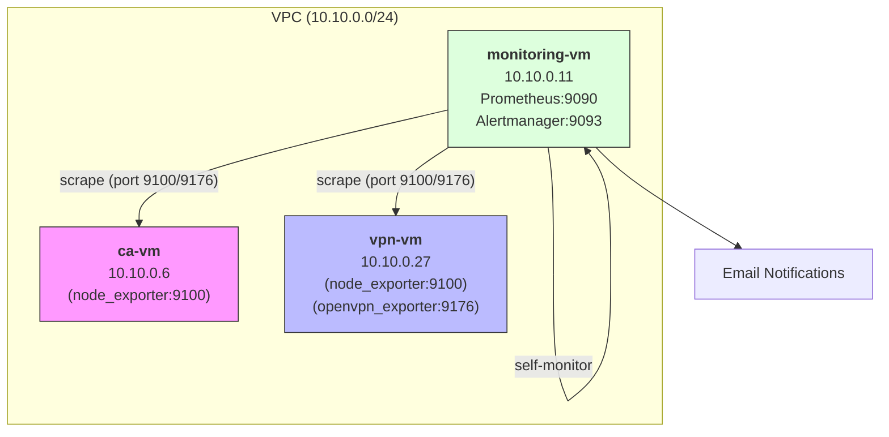

# Design of a monitoring system

## 1. Architecture

## 2. Infrastructure metrics (all VMs)

Source: **Node Exporter** (port 9100)

| Category | Metric | Description |
|-----------|---------|----------|
| CPU | node_cpu_seconds_total | CPU time by mode |
| CPU | node_load1, node_load5 | Load average |
| Memory | node_memory_MemTotal_bytes | Total RAM |
| Memory | node_memory_MemAvailable_bytes | Available RAM |
| Disk | node_filesystem_size_bytes | Size FS |
| Disk | node_filesystem_avail_bytes | Free on FS |
| Disk | node_disk_io_time_seconds_total | I/O time |
| Network | node_network_receive_bytes_total | Incoming Traffic |
| Network | node_network_transmit_bytes_total | Outgoing Traffic |
| System | node_boot_time_seconds | Boot Time |
| System | node_time_seconds | Current Time |
| Systemd | node_systemd_unit_state | Service State |

## 3. OpenVPN Monitoring

Source: **OpenVPN Exporter** (port 9176)

| Metric | Description |
|---------|---------|
| openvpn_up | Server status (1=up, 0=down) |
| openvpn_server_connected_clients | Number of connected clients |
| openvpn_server_client_received_bytes_total | Traffic from clients |
| openvpn_server_client_sent_bytes_total | Traffic to clients |

Additionally via Node Exporter:
- Traffic on the tun0 interface
- Status of the openvpn-server@server systemd service

## 4. Infrastructure alerts

| Алерт | PromQL | For | Severity |
|-------|--------|-----|----------|
| InstanceDown | up == 0 | 1m | critical |
| HighCpuUsage | 100 - (avg(rate(node_cpu_seconds_total{mode="idle"}[5m])) * 100) > 80 | 5m | warning |
| HighMemoryUsage | (1 - node_memory_MemAvailable_bytes / node_memory_MemTotal_bytes) * 100 > 90 | 5m | warning |
| DiskSpaceLow | (node_filesystem_avail_bytes / node_filesystem_size_bytes) * 100 < 15 | 5m | warning |
| DiskSpaceCritical | (node_filesystem_avail_bytes / node_filesystem_size_bytes) * 100 < 5 | 1m | critical |
| SystemdServiceFailed | node_systemd_unit_state{state="failed"} == 1 | 1m | critical |

## 5. OpenVPN Alerts

| Алерт | PromQL | For | Severity |
|-------|--------|-----|----------|
| OpenVPNDown | openvpn_up == 0 | 1m | critical |
| OpenVPNServiceDown | node_systemd_unit_state{name="openvpn-server@server.service",state="active"} != 1 | 1m | critical |
| OpenVPNNoClients | openvpn_server_connected_clients == 0 | 1h | info |

## 6. Security

- Prometheus Web UI is protected with Basic Auth
- Node Exporter is only accessible from VPC (10.10.0.0/24)
- UFW is configured on all VMs
- Port 9100 accepts requests only from monitoring-vm

## 7. Components to Install

| VM | Packages |
|----|--------|
| monitoring-vm | prometheus-server.deb, alertmanager.deb, node-exporter.deb |
| vpn-vm | node-exporter.deb, openvpn-exporter.deb |
| ca-vm | node-exporter.deb |